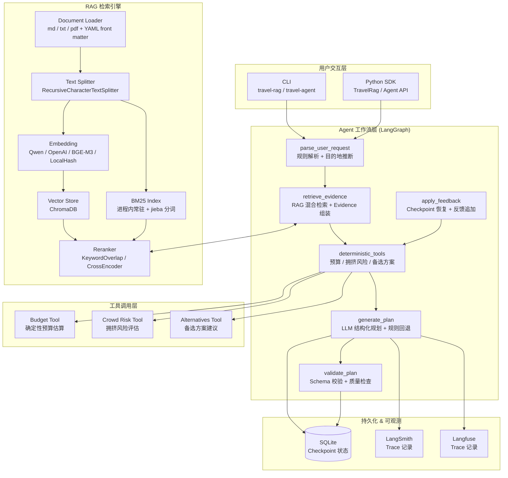
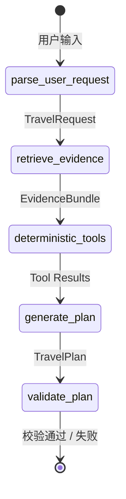
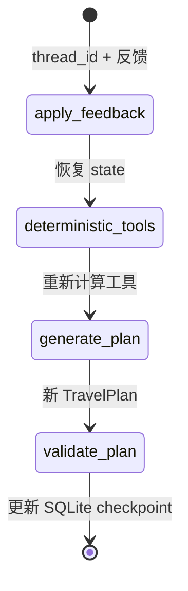

# travel-agent

> **企业级旅行智能助手** — 基于 RAG + LangGraph Agent 的旅行目的地知识库与智能规划系统。

本系统以纯 RAG（检索增强生成）为基础，结合 LangGraph 状态图工作流引擎，提供从知识库文档导入、向量化存储、混合检索、确定性工具调用到结构化行程规划的完整链路。支持 SQLite checkpoint 状态持久化，可实现线程级规划恢复与用户反馈迭代。

---

## 技术架构



### 计划工作流 (Plan Graph)



### 恢复工作流 (Resume Graph)



---

## 核心能力

### RAG 检索引擎

- **三种检索模式**：`vector`（Chroma 向量相似度）、`keyword`（BM25 关键词）、`hybrid`（RRF 融合）
- **多 Embedding 提供商**：通义千问 `text-embedding-v4`、OpenAI、BGE-M3、LocalHash（无 API Key demo）
- **中文分词**：jieba（可选）+ 内置旅行词典 + 字符 n-gram
- **Reranker 层**：默认 KeywordOverlap 规则重排，可选 BGE CrossEncoder 模型重排
- **元数据过滤**：destination、section、travel_type、season、poi_names 等多维过滤
- **增量索引**：基于 content hash 的 manifest 版本管理
- **Extractive QA**：不依赖 LLM，直接从检索 chunk 抽取答案

### LangGraph Agent 工作流

| 节点 | 功能 | 确定性 |
|------|------|--------|
| `parse_user_request` | 规则解析自然语言 → 结构化 TravelRequest（目的地/天数/人群/预算） | ✅ |
| `retrieve_evidence` | 调用 RAG 混合检索，组装 EvidenceBundle + RetrievalTrace | ✅ |
| `deterministic_tools` | 串行执行预算/拥挤风险/备选方案三个本地工具 | ✅ |
| `generate_plan` | 优先 LLM 结构化输出（Pydantic schema），无 API Key 时规则回退 | ✅ fallback |
| `validate_plan` | Schema 完整性校验 | ✅ |

### Checkpoint 状态恢复

基于 `langgraph-checkpoint-sqlite`，每次规划自动持久化到本地 SQLite：

- `original_user_request` — 用户原始输入
- `request` — 解析后的 TravelRequest
- `evidence` — RAG EvidenceBundle
- `tool_budget` / `tool_crowd_risk` / `tool_alternatives` — 工具计算结果
- `plan` — 最终 TravelPlan
- `user_feedback` — 反馈历史（resume 时追加）

```bash
# 创建规划（自动生成 thread_id）
travel-agent plan "我和父母去杭州玩3天" --embedding-provider local

# 恢复并追加反馈
travel-agent resume <thread_id> "第二天少走路，增加雨天备选"
```

### 工具调用层

三个**纯本地、零外部 API**的确定性工具，输出使用 Pydantic schema：

| 工具 | 输入 | 输出 | 核心逻辑 |
|------|------|------|----------|
| `budget_tool` | 人数/天数/预算等级/evidence | `BudgetEstimate` | 人均日消费 × 分类权重，evidence 价格提示 ±15% 调整 |
| `crowd_risk_tool` | 目的地/evidence/是否节假日 | `CrowdRiskAssessment` | POI 提取 + 关键词风险评分 + 周末/节假日升级 |
| `alternative_tool` | 目的地/evidence/拥挤评估 | `AlternativePlan` | evidence 备选 section + 高风险 POI 交叉引用 |

工具结果通过 `_apply_tool_overrides` 强制覆盖 LLM 输出，确保关键数据来自确定性计算而非模型编造。

### LLMOps 可观测性

| 后端 | 配置方式 | 记录内容 |
|------|----------|----------|
| LangSmith | `LANGCHAIN_TRACING_V2=true` | user_request, parsed_request, evidence_count, confidence, planner_model, latency, final_plan |
| Langfuse | `LANGFUSE_PUBLIC_KEY` / `LANGFUSE_SECRET_KEY` | 同上，自动并行写入 |

未配置 API Key 时自动静默 no-op，不影响系统运行。

---

## 快速开始

### 环境要求

- Python >= 3.11
- Conda 环境 `Agent`（推荐）
- 可选：通义千问 / OpenAI API Key（用于真实 embedding 和 LLM 规划）

### 安装

```powershell
# 克隆后进入项目目录
cd agent_project

# 使用 Conda Agent 环境安装（核心依赖）
conda run -n Agent python -m pip install -e .

# 推荐：增强中文分词
conda run -n Agent python -m pip install -e ".[keyword]"

# 可选：本地真实 embedding
conda run -n Agent python -m pip install -e ".[local-embeddings]"

# 可选：模型重排序
conda run -n Agent python -m pip install -e ".[reranker]"

# 可选：可观测性
conda run -n Agent python -m pip install -e ".[observability]"

# 开发依赖（测试/代码检查）
conda run -n Agent python -m pip install -e ".[dev]"
```

### Conda Agent 环境开发说明

- 推荐所有命令都在仓库根目录执行，并统一使用 `conda run -n Agent ...`
- 仓库根目录内已提供开发期源码导入兼容层，未安装 editable package 时也可以直接运行 `python -m travel_agent...`
- 如果你需要 `travel-agent` / `travel-rag` 这两个 console script，请先执行 `pip install -e .`
- `pytest` 已固定使用工作区内的 `data/.pytest_tmp` 作为临时目录，避免 Windows 用户目录权限问题
- 在 Windows PowerShell 下复制环境文件建议使用 `Copy-Item .env.example .env`

### 5 分钟 Demo（无需 API Key）

```powershell
# 1. 重置索引
conda run -n Agent python -m travel_agent.rag.cli reset --embedding-provider local --yes

# 2. 导入目的地知识库
conda run -n Agent python -m travel_agent.rag.cli ingest docs\destinations --embedding-provider local

# 3. 检索查询
conda run -n Agent python -m travel_agent.rag.cli query "杭州灵隐寺周末拥挤吗？" --destination Hangzhou --top-k 3

# 4. 抽取式问答
conda run -n Agent python -m travel_agent.rag.cli ask "杭州灵隐寺周末拥挤吗？" --destination Hangzhou --top-k 3

# 5. Agent 智能规划
conda run -n Agent python -m travel_agent.agent.cli plan "我和父母去杭州玩3天，预算中等" --embedding-provider local
```

### 使用真实 Embedding

```powershell
# 复制并编辑 .env
Copy-Item .env.example .env

# 配置通义千问 API Key 后
conda run -n Agent python -m travel_agent.rag.cli ingest docs\destinations
conda run -n Agent python -m travel_agent.agent.cli plan "杭州三日游怎么安排" --destination Hangzhou --days 3
```

---

## CLI 命令参考

### RAG CLI (`travel-rag`)

| 命令 | 说明 |
|------|------|
| `ingest <path>` | 导入 md/txt/pdf 文件或目录 |
| `query <question>` | 检索相关 chunk（支持元数据过滤） |
| `ask <question>` | 基于召回 chunk 做抽取式问答 |
| `interactive` | 进入纯 RAG 交互式查询会话 |
| `stats` | 查看 Chroma collection 统计信息 |
| `verify-embedding` | 验证 embedding provider 是否可用 |
| `eval` | 运行纯 RAG 离线召回评测 |
| `reset --yes` | 清空本地 Chroma 索引 |

### Agent CLI (`travel-agent`)

| 命令 | 说明 |
|------|------|
| `plan <query>` | 创建旅行规划（自动保存 checkpoint） |
| `resume <thread_id> <feedback>` | 恢复 checkpoint 并追加反馈重新生成 |
| `eval` | 运行 Agent 离线评测 |

### 常用参数

| 参数 | 适用命令 | 说明 |
|------|----------|------|
| `--destination` | plan/query/ask | 手动指定目的地（中文或英文名） |
| `--days` | plan | 手动指定行程天数 |
| `--embedding-provider` | plan/ingest/query/ask | embedding 提供商：local/qwen/openai/sentence-transformers |
| `--retrieval-mode` | plan/query/ask | 检索模式：vector/keyword/hybrid |
| `--section` | query/ask | 过滤到指定业务 section |
| `--top-k` | query/ask | 返回结果数量 |
| `--thread-id` | plan | 手动指定线程 ID |
| `--checkpoint-path` | plan/resume | 自定义 SQLite checkpoint 路径 |
| `--json` | plan/resume | JSON 格式输出 |

---

## 项目结构

```
agent_project/
├── src/travel_agent/
│   ├── rag/                       # 纯 RAG 模块
│   │   ├── service.py             # RagService 核心：ingest, retrieve, answer
│   │   ├── api.py                 # TravelRag 门面 + 一次性便捷函数
│   │   ├── cli.py                 # travel-rag Typer CLI
│   │   ├── config.py              # pydantic-settings 配置（前缀 TRAVEL_RAG_）
│   │   ├── embeddings.py          # Qwen/OpenAI/BGE-M3/LocalHash embedding
│   │   ├── keyword.py             # BM25 索引 + 中文分词器
│   │   ├── rerankers.py           # 规则/CrossEncoder 重排序
│   │   ├── loaders.py             # md/txt/pdf 文档加载
│   │   ├── splitters.py           # RecursiveCharacterTextSplitter 工厂
│   │   ├── vector_store.py        # Chroma 向量库辅助
│   │   ├── metadata.py            # 元数据 Pydantic schema + section 拆分
│   │   ├── manifest.py            # 增量索引 manifest 版本跟踪
│   │   ├── models.py              # SearchResult / EvidenceBundle / RetrievalTrace
│   │   ├── evaluation.py          # 纯 RAG 离线评测
│   │   └── langchain_adapters.py  # LangChain Document 适配
│   ├── agent/                     # LangGraph Agent 模块
│   │   ├── graph.py               # StateGraph 组装（plan + resume）
│   │   ├── nodes.py               # 7 个图节点函数
│   │   ├── planner.py             # TravelPlanner 协议 + LLM 结构化 / 规则回退
│   │   ├── schemas.py             # Pydantic schemas（TravelPlan 等 11 个模型）
│   │   ├── state.py               # TravelAgentState TypedDict
│   │   ├── prompts.py             # System/User prompt 构建
│   │   ├── cli.py                 # travel-agent Typer CLI
│   │   └── evaluation.py          # Agent 离线评测
│   ├── tools/                     # 确定性工具函数
│   │   ├── budget.py              # 预算估算
│   │   ├── crowd.py               # 拥挤风险评估
│   │   └── alternatives.py        # 备选方案建议
│   └── observability/             # LLMOps 追踪
│       └── tracer.py              # LangSmith + Langfuse 抽象层
├── tests/
│   ├── test_rag_pipeline.py       # RAG 单元测试（30+）
│   ├── test_recall_quality.py     # 召回质量测试
│   ├── test_agent_graph.py        # Agent 集成测试
│   ├── test_tools.py              # 工具单元测试（45+）
│   ├── test_real_embeddings.py    # 真实 embedding 冒烟测试
│   └── fixtures/
│       ├── rag_eval_cases.jsonl   # 18 个 RAG 评测用例
│       └── agent_eval_cases.jsonl # 12 个 Agent 评测用例
├── docs/destinations/             # 8 个示例目的地 Markdown 文档
├── data/                          # Chroma 向量库 + SQLite checkpoint
├── .github/workflows/ci.yml       # GitHub Actions CI
├── Dockerfile                     # 容器化构建
├── docker-compose.yml             # 多服务编排
├── Makefile                       # 开发快捷命令
├── .env.example                   # 完整环境变量配置模板
└── pyproject.toml                 # 项目元数据与依赖
```

---

## 配置说明

完整配置参见 [.env.example](.env.example)，核心配置项：

### RAG 配置 (`TRAVEL_RAG_*`)

| 变量 | 默认值 | 说明 |
|------|--------|------|
| `TRAVEL_RAG_PERSIST_DIR` | `data/chroma` | Chroma 持久化目录 |
| `TRAVEL_RAG_COLLECTION_NAME` | `travel_destinations` | Chroma collection 名称 |
| `TRAVEL_RAG_EMBEDDING_PROVIDER` | `auto` | Embedding 提供商：auto/qwen/openai/sentence-transformers/local |
| `TRAVEL_RAG_RETRIEVAL_MODE` | `hybrid` | 检索模式：vector/keyword/hybrid |
| `TRAVEL_RAG_CHUNK_SIZE` | `800` | 文本切片大小 |
| `TRAVEL_RAG_CHUNK_OVERLAP` | `120` | 切片重叠大小 |
| `TRAVEL_RAG_DEFAULT_TOP_K` | `5` | 默认返回结果数 |
| `TRAVEL_RAG_RERANKER` | `keyword` | Reranker 类型：keyword/bge-reranker/cross-encoder |
| `TRAVEL_RAG_KEYWORD_TOKENIZER` | `auto` | 中文分词器：auto/jieba/builtin |

### Agent 配置 (`TRAVEL_AGENT_*`)

| 变量 | 默认值 | 说明 |
|------|--------|------|
| `TRAVEL_AGENT_LLM_PROVIDER` | `qwen` | LLM 提供商：qwen/openai |
| `TRAVEL_AGENT_MODEL` | `qwen3-max` | LLM 模型名称 |

### API Key 配置

| 变量 | 说明 |
|------|------|
| `DASHSCOPE_API_KEY` | 阿里云百炼 API Key（Qwen embedding + LLM） |
| `OPENAI_API_KEY` | OpenAI API Key（embedding + LLM 备选） |
| `LANGCHAIN_API_KEY` | LangSmith API Key（可观测性） |
| `LANGFUSE_PUBLIC_KEY` | Langfuse Public Key（可观测性） |
| `LANGFUSE_SECRET_KEY` | Langfuse Secret Key（可观测性） |

---

## 测试与评测

### 运行测试

```powershell
# 全量测试
conda run -n Agent python -m pytest tests -q -p no:cacheprovider

# RAG 测试
conda run -n Agent python -m pytest tests\test_rag_pipeline.py -q -p no:cacheprovider

# Agent 集成测试
conda run -n Agent python -m pytest tests\test_agent_graph.py -q -p no:cacheprovider

# 工具单元测试
conda run -n Agent python -m pytest tests\test_tools.py -q -p no:cacheprovider
```

当前仓库已验证在 `Agent` conda 环境下可通过：

- `conda run -n Agent python -m pytest tests -q -p no:cacheprovider`
- `conda run -n Agent python -m travel_agent.agent.cli --help`
- `conda run -n Agent python -m travel_agent.rag.cli --help`

### 代码质量

```powershell
# Lint
conda run -n Agent python -m ruff check src tests

# Compile check
conda run -n Agent python -m compileall src tests
```

### RAG 评测

```powershell
# 召回质量评测（18 个用例）
conda run -n Agent python -m pytest tests\test_recall_quality.py -q -p no:cacheprovider

# CLI 离线评测（含质量门槛）
conda run -n Agent python -m travel_agent.rag.cli eval --embedding-provider local --retrieval-mode hybrid --json
```

**RAG 质量门槛**：recall@k >= 0.95, MRR@k >= 0.90, keyword_hit_rate@k >= 0.90, metadata_filter_accuracy >= 1.00

### Agent 评测

```powershell
# Agent 离线评测（12 个用例）
conda run -n Agent python -m travel_agent.agent.cli eval --json --verbose
```

**Agent 评测指标**：Days Match Rate, Budget Present Rate, Risk Notices Rate, Evidence Source Coverage, Low Confidence Handling Rate, Empty Result Handling Rate, Validation Pass Rate

---

## Python SDK 使用

### RAG 检索

```python
from travel_agent.rag import TravelRag

rag = TravelRag.create(embedding_provider="local")
rag.ingest("docs/destinations")

# 检索
results = rag.search("杭州预算怎么安排？", destination="Hangzhou", section="budget", top_k=3)
for r in results:
    print(r.content, r.source, r.score)

# 结构化 Evidence
evidence = rag.retrieve_evidence("北京雨天备选方案？", section="alternatives", retrieval_mode="hybrid")
print(evidence.confidence, evidence.trace)

# 抽取式问答
answer = rag.ask("杭州灵隐寺周末拥挤吗？", destination="Hangzhou", top_k=3)
print(answer.answer)
```

### Agent 调用

```python
from travel_agent.agent.cli import run_plan, resume_plan
from travel_agent.rag.api import create_rag_service

rag = create_rag_service(embedding_provider="local")

# 创建规划
payload = run_plan("杭州三日游", rag, thread_id="trip-001")
print(payload["plan"])
print(payload["tool_budget"])

# 恢复并追加反馈
resumed = resume_plan("trip-001", feedback="增加雨天备选")
print(resumed["plan"])
```

### 工具函数独立调用

```python
from travel_agent.tools.budget import estimate_budget
from travel_agent.tools.crowd import assess_crowd_risk
from travel_agent.tools.alternatives import suggest_alternatives

evidence = rag.retrieve_evidence("杭州灵隐寺周末拥挤吗？", destination="Hangzhou")
budget = estimate_budget(people_count=2, days=3, budget_level="standard", evidence=evidence)
crowd = assess_crowd_risk("Hangzhou", evidence, is_weekend_holiday=True)
alt = suggest_alternatives("Hangzhou", evidence, crowd_assessment=crowd)
```

---

## 知识库文档

### 内置目的地（8 个）

| 文档 | 目的地 | 覆盖内容 |
|------|--------|----------|
| `hangzhou.md` | 杭州 | 西湖、灵隐寺、龙井、家庭游、老人慢游、雨天备选 |
| `tokyo_family.md` | 东京 | 迪士尼、换乘、亲子酒店、排队风险 |
| `suzhou.md` | 苏州 | 园林古城、老人慢游、亲子研学、水乡备选 |
| `dali.md` | 大理 | 洱海慢游、亲子自然、包车、天气风险 |
| `changsha.md` | 长沙 | 周末美食、亲子城市游、夜间拥挤 |
| `paris.md` | 巴黎 | 家庭游、博物馆、预约排队、安全风险 |
| `chengdu.md` | 成都 | 熊猫亲子、美食、老人茶馆慢游、周边备选 |
| `beijing.md` | 北京 | 亲子文化、老人慢游、预约安检、长城备选 |

### 文档格式要求

每个文档需包含 YAML front matter + Markdown 二级标题 section：

```markdown
---
destination: Hangzhou
city: Hangzhou
country: China
travel_type: family_free_independent
season: spring,autumn
source_type: destination_guide
updated_at: 2026-05-08
language: zh
poi_names: West Lake,Lingyin Temple
price_level: mid
suitable_for: family,independent,elderly,children
---

## 概览
## 适合人群
## 交通
## 玩法
## 预算
## 住宿
## 餐饮
## 拥挤风险
## 天气风险
## 备选方案
```

---

## Docker 部署

### 单容器运行

```bash
docker build -t travel-agent .
docker run -e DASHSCOPE_API_KEY=xxx -v $(pwd)/data:/app/data travel-agent
```

### Docker Compose（推荐）

```bash
# 启动全栈服务
docker compose up -d

# 运行 RAG 评测
docker compose run --rm rag-eval

# 运行 Agent 评测
docker compose run --rm agent-eval
```

---

## 简历项目描述

> 本项目适合作为 **AI 应用开发 / 大模型应用 / 智能体工程** 方向的简历项目。

**项目名称**：旅行智能助手 — 基于 RAG + LangGraph Agent 的多模态知识检索与智能规划系统

**技术栈**：Python 3.11, LangChain, LangGraph, ChromaDB, BM25, Pydantic, Typer, SQLite, Docker, GitHub Actions, LangSmith/Langfuse

**项目亮点**：
- 独立设计并实现了完整的 RAG 检索增强生成管线，支持向量检索（ChromaDB）、BM25 关键词检索与 RRF 混合融合，覆盖文档导入、文本切片、向量化、重排序、增量索引全流程
- 基于 LangGraph 构建了 5 节点 Agent 工作流（解析→检索→工具调用→生成→校验），支持 SQLite checkpoint 状态持久化与线程级规划恢复
- 设计并实现了三个纯本地确定性工具函数（预算估算、拥挤风险评估、备选方案建议），通过 `_apply_tool_overrides` 机制确保工具结果强制覆盖 LLM 输出，杜绝模型幻觉
- 集成了 LangSmith + Langfuse 双通道 LLMOps 可观测性，支持无 API Key 场景自动静默降级
- 包含完整的离线评测体系：RAG 召回评测（recall/MRR/nDCG 6 项指标 + 质量门槛）和 Agent 输出评测（覆盖率/准确率/鲁棒性 8 项指标）
- 具备企业级工程化能力：CLI 命令行工具、Docker 容器化、GitHub Actions CI/CD、Makefile 自动化、完整的单元测试与评测用例

---

## Windows / Chroma 兼容性

- `chromadb` 固定 `>=0.4.22,<0.5`，避免 1.x 的 native upsert 兼容问题
- `numpy` 固定 `>=1.24,<2`，避免 ChromaDB 0.4.x 的 API 兼容问题
- Chroma 默认 ONNX embedding 已禁用，使用项目自有 embedding
- Vector 检索空结果时自动 fallback 到 BM25 常驻索引
- 建议不要并行运行多个写入 Chroma 的进程

---

## License

Internal demo. See document front matter for per-document license.
