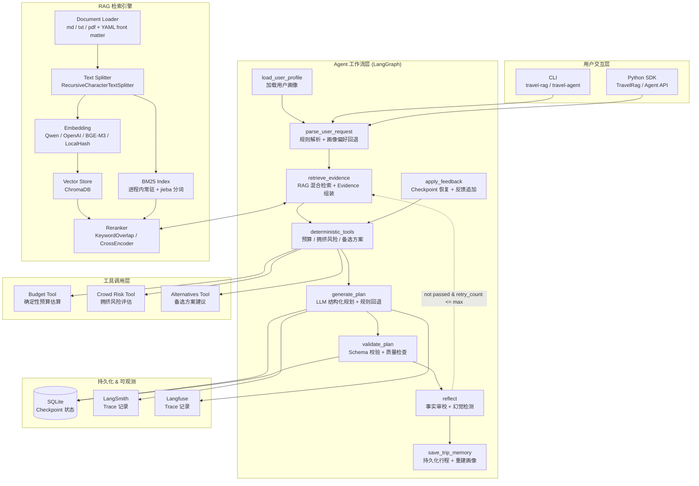
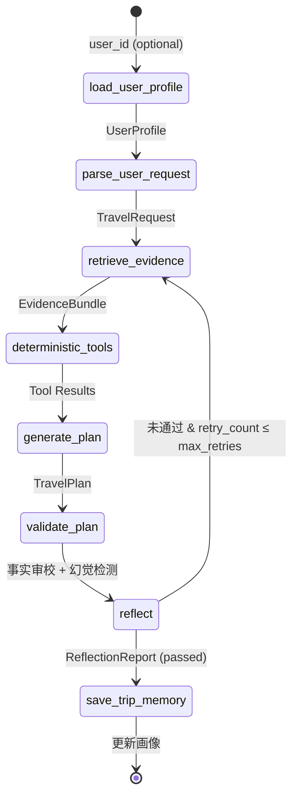
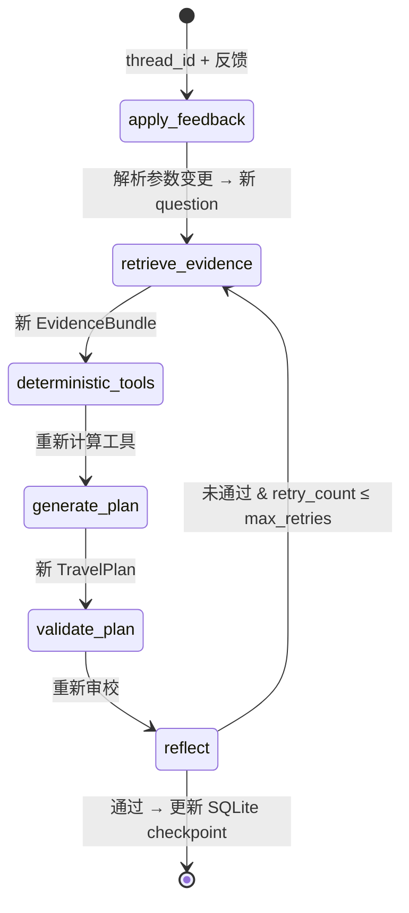
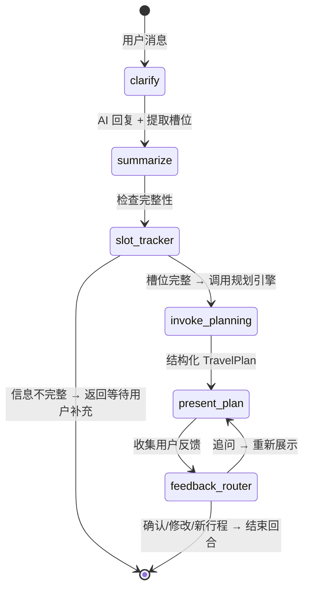

# travel-agent

> **企业级旅行智能助手** — 基于 RAG + LangGraph Agent 的旅行目的地知识库与智能规划系统。

本系统以纯 RAG（检索增强生成）为基础，结合 LangGraph 状态图工作流引擎，提供从知识库文档导入、向量化存储、混合检索、确定性工具调用到结构化行程规划的完整链路。支持 SQLite checkpoint 状态持久化，可实现线程级规划恢复与用户反馈迭代。

## 这是什么

这是一个面向旅行规划场景的本地优先 Agent 项目，核心分成两层：

- **RAG 检索层**：导入目的地 Markdown / TXT / PDF 文档，建立 Chroma + BM25 混合检索知识库
- **Agent 规划层**：基于 LangGraph 把“解析需求 → 检索证据 → 工具计算 → 生成行程 → 审校结果 → 持久化记忆”串成完整工作流

你可以把它当成：

- 一个可运行的 **RAG + Agent 工程模板**
- 一个带 **checkpoint 恢复 / 用户画像 / 审校闭环** 的旅行助手 demo
- 一个适合展示在简历或作品集里的 **完整 AI 应用项目**

## 你能直接做什么

- 导入自己的目的地文档，构建本地旅行知识库
- 用 `travel-rag query` / `travel-rag ask` 做纯检索与抽取式问答
- 用 `travel-agent plan` 生成结构化旅行计划
- 用 `travel-agent chat` 进入交互式对话规划，与 AI 旅行顾问自然对话
- 用 `travel-agent resume` 基于 thread_id 继续修改已有计划
- 通过 `--user-id` 启用长期记忆，让系统学习用户偏好
- 通过 `--query-rewrite`、`ReflectionReport`、本地工具层观察更完整的 Agent 链路

## 最短上手路径

如果你只想先确认项目能跑通，按下面 3 步即可：

```powershell
# 1. 安装核心依赖
conda run -n Agent python -m pip install -e .

# 2. 导入内置目的地文档
conda run -n Agent python -m travel_agent.rag.cli ingest docs\destinations --embedding-provider local

# 3. 直接生成一条旅行计划
conda run -n Agent python -m travel_agent.agent.cli plan "我和父母去杭州玩3天，预算中等" --embedding-provider local
```

如果上面 3 步能成功，你再继续看后面的架构、Memory、Reflection、对话模式和 Docker 部分会更顺手。

```powershell
# 4. 进入交互式对话规划（需要 API Key）
conda run -n Agent python -m travel_agent.agent.cli chat --embedding-provider local
```

---

## 技术架构



### 计划工作流 (Plan Graph)

启用 Memory 时，Agent 在规划前加载用户画像，规划后自动保存行程记录。



### 恢复工作流 (Resume Graph)

反馈中如包含「改成」「换成」「改为」等变更意图，`apply_feedback` 会自动重解析目的地/天数/预算并触发 RAG 重检索。



### 对话式工作流 (Conversation Graph)

对话模式将自然对话与 Agent 规划融合：每回合处理用户消息 → 澄清需求 → 检查槽位完整 → 自动触发规划 → 展示计划 → 收集反馈。



**核心概念**：

- **槽位填充**：通过自然对话逐步收集目的地、天数、预算、出行人员，而非填表式逐项询问
- **规则 + LLM 双层澄清**：规则解析中国城市名/预算关键词（更可靠），LLM 理解自然语言意图
- **信息回退**：超 8 轮澄清后自动使用默认值（目的地=杭州、天数=3、预算=standard、人群=general）
- **反馈路由**：自动识别用户反馈意图（修改/认可/追问/新行程），路由到相应处理流程
- **斜杠命令**：`/plan` 强制规划、`/feedback` 修改意见、`/profile` 查看画像、`/history` 对话摘要、`/reset` 重新开始、`/export` 导出 JSON
- **对话摘要**：超过 20 条消息自动压缩对话历史，避免上下文溢出
- **流式输出**：支持 `--streaming` / `--no-streaming` 控制

---

## 核心能力

### RAG 检索引擎

- **三种检索模式**：`vector`（Chroma 向量相似度）、`keyword`（BM25 关键词）、`hybrid`（RRF 融合）
- **多 Embedding 提供商**：通义千问 `text-embedding-v4`、OpenAI、BGE-M3、LocalHash（无 API Key demo）
- **中文分词**：jieba（可选）+ 内置旅行词典 + 字符 n-gram
- **Query Rewrite 查询改写**：LLM 驱动（`off / rewrite_only / multi_query` 三种模式），将口语化问题改写为精准检索 query；`multi_query` 模式支持多条改写 query 并发检索 + RRF 融合
- **Reranker 层**：默认 KeywordOverlap 规则重排，可选 BGE CrossEncoder 模型重排
- **元数据过滤**：destination、section、travel_type、season、poi_names 等多维过滤
- **增量索引**：基于 content hash 的 manifest 版本管理
- **Extractive QA**：不依赖 LLM，直接从检索 chunk 抽取答案

### 集中化领域知识

`travel_agent.knowledge` 模块是整个系统的 **单一知识来源**（Single Source of Truth），集中管理：

- **目的地别名**：中英文名 → 标准英文名映射（8 个目的地）
- **Section 别名**：查询词 → 业务 section 映射（9 个 section）
- **中文数字**：一-十 → 阿拉伯数字
- **节假日关键词**：40+ 中英文节假日词汇 + 预编译正则
- **内置中文旅行词典**：60 个核心旅行词汇（目的地/POI/交通/住宿等）
- **人群推断**：隐含人数模式匹配

所有 `service.py`、`nodes.py`、`keyword.py` 均从该模块统一 import，**新增目的地只需修改 `knowledge.py` 一个文件**。

```python
from travel_agent.knowledge import DESTINATION_ALIASES, SECTION_QUERY_ALIASES
```

### LangGraph Agent 工作流

| 节点 | 功能 | 确定性 |
|------|------|--------|
| `load_user_profile` | 从 Memory SQLite 加载用户画像，无 user_id 时自动跳过 | ✅ |
| `parse_user_request` | 规则解析自然语言 → 结构化 TravelRequest，画像偏好作为回退 | ✅ |
| `retrieve_evidence` | 调用 RAG 混合检索，组装 EvidenceBundle + RetrievalTrace | ✅ |
| `deterministic_tools` | 串行执行预算/拥挤风险/备选方案三个本地工具 | ✅ |
| `generate_plan` | 优先 LLM 结构化输出（Pydantic schema），无 API Key 时规则回退 | ✅ fallback |
| `validate_plan` | Schema 完整性校验 | ✅ |
| `reflect` | 回答审校：逐条交叉验证 plan 与 evidence，检测幻觉与不一致 | ✅ |
| `save_trip_memory` | 持久化行程到 Memory，重建用户画像，无 user_id 时自动跳过 | ✅ |

### Memory 长期记忆 — 用户画像

Memory 模块赋予 Agent 跨会话的 **"用户画像"** 能力，每次规划后自动将行程持久化到 SQLite，并从历史行程中聚合学习用户偏好。

**核心特性**：

- **自动画像构建**：每次 `plan` / `resume` 后自动保存行程记录，实时聚合偏好目标地、预算等级、出行类型、平均行程天数
- **偏好回退**：用户未在请求中明确指定预算/人群时，自动使用画像中的历史偏好作为默认值
- **规划个性化**：画像上下文（偏好总结）自动注入 Planner prompt，LLM 可据此个性化推荐
- **用户隔离**：不同 `user_id` 完全独立存储，互不干扰
- **零侵入**：不传 `--user-id` 时系统行为完全不变，向下兼容

**数据模型**：

| 模型 | 说明 |
|------|------|
| `TripRecord` | 单次行程记录（目的地/天数/人群/预算/摘要/反馈） |
| `UserProfile` | 聚合用户画像（偏好目标地/预算/出行方式/平均天数/偏好总结） |

**工作流**：

```
用户请求 → load_user_profile → parse (画像回退) → RAG → Tools → generate (画像上下文) → validate → save_trip_memory → 更新画像
```

**CLI 示例**：

```bash
# 首次规划（自动创建用户画像）
travel-agent plan "和女朋友去东京5天" --user-id user_001 --embedding-provider local

# 画像已学习到 premium + couple 偏好，后续无需重复指定
travel-agent plan "去杭州玩3天" --user-id user_001 --embedding-provider local

# 显式指定可覆盖画像偏好
travel-agent plan "北京3天穷游" --user-id user_001 --embedding-provider local
```

**Python SDK**：

```python
from pathlib import Path

from travel_agent.memory import MemoryStore
from travel_agent.agent.cli import run_plan

store = MemoryStore(Path("data/user_memory.sqlite"))

# 带用户画像的规划
result = run_plan("杭州三日游", rag, user_id="user_001", memory_store=store)
print(result["user_profile"])  # 查看聚合画像
print(result["user_profile"]["preferences_summary"])  # 偏好总结

# 查看历史行程
trips = store.list_user_trips("user_001")
for t in trips:
    print(f"{t.destination} {t.days}天 {t.budget_preference}")
```

### Checkpoint 状态恢复

基于 `langgraph-checkpoint-sqlite`，每次规划自动持久化到本地 SQLite：

- `original_user_request` — 用户原始输入
- `request` — 解析后的 TravelRequest
- `evidence` — RAG EvidenceBundle
- `tool_budget` / `tool_crowd_risk` / `tool_alternatives` — 工具计算结果
- `plan` — 最终 TravelPlan
- `user_feedback` — 反馈历史（resume 时追加）

```bash
# 创建规划（自动生成 thread_id）
travel-agent plan "我和父母去杭州玩3天" --embedding-provider local

# 恢复并追加反馈（不改变核心参数）
travel-agent resume <thread_id> "第二天少走路，增加雨天备选" --embedding-provider local

# 恢复并修改目的地 / 天数（自动触发 RAG 重检索）
travel-agent resume <thread_id> "改成去北京玩两天" --embedding-provider local

# 开启查询改写 — 口语化问题自动改写为精准检索 query（需要 API Key）
travel-agent plan "带父母去个不太挤有文化的地方玩几天" --query-rewrite rewrite_only

# 多查询融合 — 原始 query + 多条改写 query 并发检索，RRF 融合
travel-agent plan "杭州周末三日游怎么安排比较好" --query-rewrite multi_query
```

### 工具调用层

三个**纯本地、零外部 API**的确定性工具，输出使用 Pydantic schema：

| 工具 | 输入 | 输出 | 核心逻辑 |
|------|------|------|----------|
| `budget_tool` | 人数/天数/预算等级/evidence | `BudgetEstimate` | 人均日消费 × 分类权重，evidence 价格提示 ±15% 调整 |
| `crowd_risk_tool` | 目的地/evidence/是否节假日 | `CrowdRiskAssessment` | POI 提取 + 关键词风险评分 + 周末/节假日升级 |
| `alternative_tool` | 目的地/evidence/拥挤评估 | `AlternativePlan` | evidence 备选 section + 高风险 POI 交叉引用 |

工具结果通过 `_apply_tool_overrides` 强制覆盖 LLM 输出，确保关键数据来自确定性计算而非模型编造。

### Reflection 回答审校 — 减少事实幻觉

Reflection 节点 (`reflect_node`) 在 plan 生成后自动运行，对生成结果进行**事实审校**。系统采用 **LLM 结构化输出（主） + 确定性文本相似度（回退）** 双层架构，将 plan 中的每一条声明与 RAG evidence 进行交叉比对，检测并标记潜在的幻觉内容。

**双层审校架构**：

| 层级 | 引擎 | 触发条件 | 方法 |
|------|------|----------|------|
| 主审校 | `ReflectionService` (LLM) | 有 `DASHSCOPE_API_KEY` / `OPENAI_API_KEY` | LLM structured output → `ReflectionReport` |
| 确定性回退 | `deterministic_reflect()` | 无 API Key 或 LLM 调用失败 | `SequenceMatcher` 文本相似度 + 别名检测 |

**审校维度**：

| 维度 | 检测内容 | LLM 层方法 | 确定性回退方法 |
|------|----------|-----------|--------------|
| 行程活动 | DayPlan activities 是否与 evidence 内容一致 | LLM 逐条交叉校验 + 语义判断 | `SequenceMatcher` 逐条相似度计算 |
| 预算项目 | BudgetItems 是否与 `tool_budget` 确定性结果一致 | LLM 数值比对 + 工具结果交叉引用 | 工具结果关键词交叉比对 |
| 风险提示 | RiskNotices 是否与 `tool_crowd_risk` 结果一致 | LLM 风险类型匹配 + 工具交叉引用 | 工具结果文本匹配 |
| 备选方案 | Alternatives 是否在 evidence 或 `tool_alternatives` 中有支撑 | LLM 语义匹配 | 文本重叠检测 |
| 目的地一致性 | Plan 是否混入了其他目的地的 POI | LLM 目的地语义校验 | `DESTINATION_ALIASES` 跨目的地污染检测 |

**输出 `ReflectionReport`**：

| 字段 | 说明 |
|------|------|
| `hallucination_flags` | 逐条幻觉标记（位置、声称内容、问题说明、严重度 high/medium/low） |
| `evidence_coverage` | 证据覆盖率：有证据支撑的声明占比（0.0-1.0） |
| `confidence_score` | 综合置信度（LLM: 自由评分；确定性回退: 覆盖率为基础，高严重度扣分） |
| `issues` | 人类可读的问题摘要 |
| `suggestions` | 可操作的改进建议 |
| `passed` | 是否通过审校（LLM: `coverage >= TRAVEL_AGENT_REFLECTION_COVERAGE_THRESHOLD` 且无标记；确定性回退: 无标记 且 coverage >= 30%） |
| `checked_claims` | 检视的声明总数 |
| `grounded_claims` | 有证据支撑的声明数 |

**条件重审循环 (Conditional Retry Loop)**：

当 Reflection Report 未通过（`passed=False`）时，LangGraph 状态图会**自动触发补充检索 + 重新规划 + 重新审校**的循环。当前 CLI / 默认调用路径下，图的重试上限默认为 **1 次**，并通过 `reflection_retry_count` 字段跟踪重试次数，防止无限循环。  
如果你通过 Python 自己组装图，可以在 `build_travel_agent_graph(...)` / `build_travel_agent_resume_graph(...)` 中显式传入 `max_reflection_retries` 来覆盖默认值。

```
reflect → (不通过 & retry_count <= max_retries) → retrieve_evidence → tools → generate → validate → reflect
reflect → (通过 | retry_count > max_retries) → save_trip_memory / END
```

**核心特性**：
- **LLM 优先、确定性兜底**：有 API Key 时使用 LLM 结构化输出做语义级事实核查；无 API Key 时自动降级为 `SequenceMatcher` 文本相似度检测
- **跨目的地污染检测**：无论使用哪层审校，始终执行基于 `DESTINATION_ALIASES` 的确定性跨目的地 POI 检测（LLM 可能遗漏的别名匹配）
- **条件循环重生成**：审校未通过时自动触发补充检索 → 重新规划 → 重新审校，形成闭环质量保障
- **CLI 可视化**：plan 输出末尾展示 Reflection Report，包含幻觉标记表格和问题摘要
- **Trace 集成**：审校结果自动写入 LangSmith/Langfuse trace

**配置环境变量**：

| 变量 | 默认值 | 说明 |
|------|--------|------|
| `TRAVEL_AGENT_REFLECTION_COVERAGE_THRESHOLD` | `0.5` | LLM 审校通过的最低证据覆盖率 |

> 说明：`TRAVEL_AGENT_REFLECTION_MAX_RETRIES` 这一配置更适合在你自己的二次封装里使用；当前仓库默认 CLI 的重试次数以图构建参数为准。

**CLI 输出示例**：

```
┌─────────────────────────────────────────┐
│ Reflection Report — PASSED              │
├─────────────────────────────────────────┤
│ Evidence coverage: 85% | Confidence: 78%│
│ Claims grounded: 17/20                  │
└─────────────────────────────────────────┘
```

```python
# Python SDK 中访问审校结果
payload = run_plan("杭州三日游", rag)
reflection = payload["reflection"]
print(f"Coverage: {reflection['evidence_coverage']:.0%}")
for flag in reflection["hallucination_flags"]:
    print(f"[{flag['severity']}] {flag['location']}: {flag['issue']}")

# 使用自定义 ReflectionService
from travel_agent.agent.reflection import build_reflection_service, ReflectionService

service = build_reflection_service()  # 从环境变量自动配置
# 或手动构建
service = ReflectionService(coverage_threshold=0.6)
```

### 对话式规划 — 自然语言交互式行程设计

对话式规划模块 (`conversation/`) 在计划工作流之上封装了一层 **交互式对话层**，让用户能用自然聊天的方式完成旅行规划，而非一次性命令行输入。

**双层架构**：

| 层级 | 引擎 | 说明 |
|------|------|------|
| 对话澄清层 | `ClarificationOutput` (LLM 结构化输出) + 规则解析 | 从用户消息中提取旅行槽位，生成自然中文回复 |
| 规划引擎层 | Plan Graph（8 节点工作流） | 槽位完整后自动调用，生成完整旅行计划 |

**槽位收集机制**：

| 槽位 | 优先级 | 默认值 | 提取方式 |
|------|--------|--------|----------|
| 目的地 | 必须 | 无（缺失时触发推荐） | `DESTINATION_ALIASES` 别名映射（规则优先） |
| 游玩天数 | 重要 | 3 天 | 中文数字 + 阿拉伯数字正则匹配 |
| 预算水平 | 一般 | `standard` | 关键词匹配（经济/适中/高端等） |
| 出行人员 | 一般 | `general` | 人群关键词 + LLM 语义理解 |

**对话阶段流转**：

```
greeting → clarifying ⇄ slot_tracker → planning → presenting → feedback
              ↑                                      │
              └──── 用户补充信息 (下一轮) ←───────────┘
```

**核心特性**：
- **温暖对话风格**：Agent 以"小旅"身份用自然语言交流，每次最多问 1-2 个问题，不填表式追问
- **模糊需求推荐**：用户说"随便""推荐""你来定"时，给出 5 个热门目的地建议
- **规则优先 + LLM 兜底**：目的地/天数/预算用规则解析（中文地名更可靠），意图理解和回复生成走 LLM
- **跨轮次记忆**：通过 SQLite checkpoint 持久化澄清进度，槽位值在对话各轮之间自动保留
- **反馈意图分类**：自动区分用户反馈为 modify / approve / question / new_trip 并路由
- **降级链设计**：LLM structured output → LLM 普通调用 + 文本解析 → 规则兜底（保证无 API Key 也能用）

**CLI 快速体验**：

```powershell
# 启动对话式规划（需要 API Key）
conda run -n Agent python -m travel_agent.agent.cli chat --embedding-provider local

# 指定用户 ID 启用长期记忆
conda run -n Agent python -m travel_agent.agent.cli chat --user-id user_001 --embedding-provider local

# 恢复之前的对话
conda run -n Agent python -m travel_agent.agent.cli chat --thread-id <thread_id> --embedding-provider local

# 无流式输出
conda run -n Agent python -m travel_agent.agent.cli chat --no-streaming --embedding-provider local
```

**对话示例**：

```
小旅: 您好！我是您的旅行规划顾问小旅。
      现在，告诉我您想去哪里吧！

您: 想去杭州玩几天

小旅: 杭州是个很美的城市！请问计划玩几天呢？
      另外，是跟谁一起出行呢？

您: 3天，和女朋友一起去

小旅: 好的，杭州3天情侣出行。预算方面有什么偏好吗？
      比如经济实惠、中等标准还是高端舒适？

您: 中等就行

小旅: 好的，我这就为您规划！

[生成完整旅行计划，包含每日行程、预算、风险提示、备选方案]

小旅: 这个行程怎么样？需要调整的话随时告诉我~

您: 第二天少走路

小旅: 已为您调整第二天的行程，减少了步行量...
```

### LLMOps 可观测性

| 后端 | 配置方式 | 记录内容 |
|------|----------|----------|
| LangSmith | `LANGCHAIN_TRACING_V2=true` | user_request, parsed_request, evidence_count, confidence, planner_model, latency, final_plan |
| Langfuse | `LANGFUSE_PUBLIC_KEY` / `LANGFUSE_SECRET_KEY` | 同上，自动并行写入 |

未配置 API Key 时自动静默 no-op，不影响系统运行。

---

## 快速开始

### 环境要求

- Python >= 3.11
- Conda 环境 `Agent`（推荐）
- 可选：通义千问 / OpenAI API Key（用于真实 embedding 和 LLM 规划）

### 安装

```powershell
# 克隆后进入项目目录
cd agent_project

# 使用 Conda Agent 环境安装（核心依赖）
conda run -n Agent python -m pip install -e .

# 推荐：增强中文分词
conda run -n Agent python -m pip install -e ".[keyword]"

# 可选：本地真实 embedding
conda run -n Agent python -m pip install -e ".[local-embeddings]"

# 可选：模型重排序
conda run -n Agent python -m pip install -e ".[reranker]"

# 可选：可观测性
conda run -n Agent python -m pip install -e ".[observability]"

# 开发依赖（测试/代码检查）
conda run -n Agent python -m pip install -e ".[dev]"
```

### Conda Agent 环境开发说明

- **环境名称**：`Agent`（推荐使用此名称创建 conda 环境）
- 推荐所有命令都在仓库根目录执行，并统一使用 `conda run -n Agent ...`
- 仓库根目录内已提供开发期源码导入兼容层，未安装 editable package 时也可以直接运行 `python -m travel_agent...`
- 如果你需要 `travel-agent` / `travel-rag` 这两个 console script，请先执行 `pip install -e .`
- `pytest` 已通过 `pytest.ini` 将临时目录固定到 `.tmp_pytest`，无需手动传 `--basetemp`
- 在 Windows PowerShell 下复制环境文件建议使用 `Copy-Item .env.example .env`

**创建并配置 Agent 环境**：

```powershell
# 创建 conda 环境（Python >= 3.11）
conda create -n Agent python=3.11 -y

# 激活环境
conda activate Agent

# 安装核心依赖
pip install -e .

# 安装开发依赖（含 ruff、pytest、mypy）
pip install -e ".[dev]"

# 推荐：安装中文分词支持
pip install -e ".[keyword]"
```

### 5 分钟 Demo（无需 API Key）

```powershell
# 1. 重置索引
conda run -n Agent python -m travel_agent.rag.cli reset --embedding-provider local --yes

# 2. 导入目的地知识库
conda run -n Agent python -m travel_agent.rag.cli ingest docs\destinations --embedding-provider local

# 3. 检索查询
conda run -n Agent python -m travel_agent.rag.cli query "杭州灵隐寺周末拥挤吗？" --destination Hangzhou --top-k 3

# 4. 抽取式问答
conda run -n Agent python -m travel_agent.rag.cli ask "杭州灵隐寺周末拥挤吗？" --destination Hangzhou --top-k 3

# 5. Agent 智能规划
conda run -n Agent python -m travel_agent.agent.cli plan "我和父母去杭州玩3天，预算中等" --embedding-provider local

# 6. 交互式对话规划（需要 API Key）
conda run -n Agent python -m travel_agent.agent.cli chat --embedding-provider local
```

### 使用真实 Embedding

```powershell
# 复制并编辑 .env
Copy-Item .env.example .env

# 配置通义千问 API Key 后
conda run -n Agent python -m travel_agent.rag.cli ingest docs\destinations
conda run -n Agent python -m travel_agent.agent.cli plan "杭州三日游怎么安排" --destination Hangzhou --days 3
conda run -n Agent python -m travel_agent.agent.cli chat  # 交互式对话规划
```

---

## CLI 命令参考

### RAG CLI (`travel-rag`)

| 命令 | 说明 |
|------|------|
| `ingest <path>` | 导入 md/txt/pdf 文件或目录 |
| `query <question>` | 检索相关 chunk（支持元数据过滤） |
| `ask <question>` | 基于召回 chunk 做抽取式问答 |
| `interactive` | 进入纯 RAG 交互式查询会话 |
| `stats` | 查看 Chroma collection 统计信息 |
| `verify-embedding` | 验证 embedding provider 是否可用 |
| `eval` | 运行纯 RAG 离线召回评测 |
| `reset --yes` | 清空本地 Chroma 索引 |

### Agent CLI (`travel-agent`)

| 命令 | 说明 |
|------|------|
| `plan <query>` | 创建旅行规划（自动保存 checkpoint） |
| `resume <thread_id> <feedback>` | 恢复 checkpoint 并追加反馈重新生成 |
| `chat` | 启动交互式对话规划会话（支持斜杠命令） |
| `eval` | 运行 Agent 离线评测 |

### 常用参数

| 参数 | 适用命令 | 说明 |
|------|----------|------|
| `--destination` | plan/query/ask | 手动指定目的地（中文或英文名） |
| `--days` | plan | 手动指定行程天数 |
| `--embedding-provider` | plan/resume/ingest/query/ask | embedding 提供商：local/qwen/openai/sentence-transformers |
| `--query-rewrite` | plan/resume | Query Rewrite 模式：off / rewrite_only / multi_query |
| `--retrieval-mode` | query/ask | 检索模式：vector/keyword/hybrid |
| `--section` | query/ask | 过滤到指定业务 section |
| `--top-k` | query/ask | 返回结果数量 |
| `--thread-id` | plan/chat | 手动指定线程 ID |
| `--user-id` | plan/resume/chat | 用户 ID，启用长期记忆与用户画像 |
| `--memory-path` | plan/resume/chat | 自定义 Memory SQLite 路径（默认 data/user_memory.sqlite） |
| `--checkpoint-path` | plan/resume/chat | 自定义 SQLite checkpoint 路径 |
| `--json` | plan/resume | JSON 格式输出 |
| `--streaming/--no-streaming` | chat | 启用/禁用流式输出 |

---

## 项目结构

```
agent_project/
├── src/travel_agent/
│   ├── knowledge.py               # 集中化领域知识（目的地/别名/分词/节假日等常量）
│   ├── rag/                       # 纯 RAG 模块
│   │   ├── service.py             # RagService 核心：ingest, retrieve, answer
│   │   ├── api.py                 # TravelRag 门面 + 一次性便捷函数
│   │   ├── cli.py                 # travel-rag Typer CLI
│   │   ├── config.py              # pydantic-settings 配置（前缀 TRAVEL_RAG_）
│   │   ├── embeddings.py          # Qwen/OpenAI/BGE-M3/LocalHash embedding
│   │   ├── keyword.py             # BM25 索引 + 中文分词器
│   │   ├── rerankers.py           # 规则/CrossEncoder 重排序
│   │   ├── loaders.py             # md/txt/pdf 文档加载
│   │   ├── splitters.py           # RecursiveCharacterTextSplitter 工厂
│   │   ├── vector_store.py        # Chroma 向量库辅助
│   │   ├── metadata.py            # 元数据 Pydantic schema + section 拆分
│   │   ├── manifest.py            # 增量索引 manifest 版本跟踪
│   │   ├── models.py              # SearchResult / EvidenceBundle / RetrievalTrace / QueryRewriteResult
│   │   ├── query_rewrite.py       # LLMQueryRewriter + 多查询 RRF 融合检索
│   │   ├── evaluation.py          # 纯 RAG 离线评测
│   │   └── langchain_adapters.py  # LangChain Document 适配
│   ├── agent/                     # LangGraph Agent 模块
│   │   ├── graph.py               # StateGraph 组装（plan + resume，含条件重审循环）
│   │   ├── nodes.py               # 8 个图节点函数（含 Reflection 审校）
│   │   ├── planner.py             # TravelPlanner 协议 + LLM 结构化 / 规则回退
│   │   ├── reflection.py          # ReflectionService（LLM 审校 + 确定性回退 + 工厂函数）
│   │   ├── schemas.py             # Pydantic schemas（TravelPlan / ReflectionReport 等 13 个模型）
│   │   ├── state.py               # TravelAgentState TypedDict
│   │   ├── prompts.py             # System/User prompt 构建（含 REFLECTION_SYSTEM_PROMPT）
│   │   ├── cli.py                 # travel-agent Typer CLI
│   │   ├── display.py             # 基于 Rich 的计划美化展示
│   │   └── evaluation.py          # Agent 离线评测
│   ├── conversation/              # 对话式规划模块
│   │   ├── graph.py               # Conversation Graph 图编排（7 节点）
│   │   ├── nodes.py               # 图节点实现（greet/clarify/slot_tracker/planning/present/feedback）
│   │   ├── state.py               # ConversationState TypedDict（槽位 + 消息历史 + 路由字段）
│   │   ├── prompts.py             # 对话提示词（澄清/展示/反馈分类系统提示词）
│   │   ├── slot_tracker.py        # 确定性槽位填充（目的地/天数/预算/出行人员 + 默认值）
│   │   ├── cli_repl.py            # 基于 Rich 的交互式 REPL（Readline 历史 + 斜杠命令）
│   │   └── __init__.py            # 公共 API
│   ├── tools/                     # 确定性工具函数
│   │   ├── budget.py              # 预算估算
│   │   ├── crowd.py               # 拥挤风险评估
│   │   └── alternatives.py        # 备选方案建议
│   ├── memory/                    # 长期记忆模块
│   │   ├── models.py              # UserProfile / TripRecord 模型
│   │   ├── store.py               # SQLite 持久化 MemoryStore
│   │   └── __init__.py            # 公共 API
│   └── observability/             # LLMOps 追踪
│       └── tracer.py              # LangSmith + Langfuse 抽象层
├── tests/
│   ├── test_knowledge.py          # 知识模块单元测试（20 个用例）
│   ├── test_rag_pipeline.py       # RAG 单元测试（30+）
│   ├── test_recall_quality.py     # 召回质量测试
│   ├── test_agent_graph.py        # Agent 集成测试（36 个用例）
│   ├── test_tools.py              # 工具单元测试（45+）
│   ├── test_memory.py             # Memory 模块测试（15 个用例）
│   ├── test_conversation.py       # 对话式规划测试（30+ 个用例）
│   ├── test_real_embeddings.py    # 真实 embedding 冒烟测试
│   └── fixtures/
│       ├── rag_eval_cases.jsonl   # 18 个 RAG 评测用例
│       └── agent_eval_cases.jsonl # 12 个 Agent 评测用例
├── docs/destinations/             # 8 个示例目的地 Markdown 文档
├── data/                          # Chroma 向量库 + SQLite checkpoint
├── .github/workflows/ci.yml       # GitHub Actions CI
├── Dockerfile                     # 容器化构建
├── docker-compose.yml             # 多服务编排
├── Makefile                       # 开发快捷命令
├── .env.example                   # 完整环境变量配置模板
└── pyproject.toml                 # 项目元数据与依赖
```

---

## 配置说明

完整配置参见 [.env.example](.env.example)，核心配置项：

### RAG 配置 (`TRAVEL_RAG_*`)

| 变量 | 默认值 | 说明 |
|------|--------|------|
| `TRAVEL_RAG_PERSIST_DIR` | `data/chroma` | Chroma 持久化目录 |
| `TRAVEL_RAG_COLLECTION_NAME` | `travel_destinations` | Chroma collection 名称 |
| `TRAVEL_RAG_EMBEDDING_PROVIDER` | `auto` | Embedding 提供商：auto/qwen/openai/sentence-transformers/local |
| `TRAVEL_RAG_RETRIEVAL_MODE` | `hybrid` | 检索模式：vector/keyword/hybrid |
| `TRAVEL_RAG_CHUNK_SIZE` | `800` | 文本切片大小 |
| `TRAVEL_RAG_CHUNK_OVERLAP` | `120` | 切片重叠大小 |
| `TRAVEL_RAG_DEFAULT_TOP_K` | `5` | 默认返回结果数 |
| `TRAVEL_RAG_RERANKER` | `keyword` | Reranker 类型：keyword/bge-reranker/cross-encoder |
| `TRAVEL_RAG_KEYWORD_TOKENIZER` | `auto` | 中文分词器：auto/jieba/builtin |
| `TRAVEL_RAG_QUERY_REWRITE` | `off` | Query Rewrite 模式：off / rewrite_only / multi_query |
| `TRAVEL_RAG_QUERY_REWRITE_PROVIDER` | `qwen` | Query Rewrite LLM 提供商：qwen / openai |
| `TRAVEL_RAG_QUERY_REWRITE_MODEL` | `qwen3-max` | Query Rewrite LLM 模型名称 |

### Agent 配置 (`TRAVEL_AGENT_*`)

| 变量 | 默认值 | 说明 |
|------|--------|------|
| `TRAVEL_AGENT_LLM_PROVIDER` | `qwen` | LLM 提供商：qwen/openai |
| `TRAVEL_AGENT_MODEL` | `qwen3-max` | LLM 模型名称 |

### API Key 配置

| 变量 | 说明 |
|------|------|
| `DASHSCOPE_API_KEY` | 阿里云百炼 API Key（Qwen embedding + LLM） |
| `OPENAI_API_KEY` | OpenAI API Key（embedding + LLM 备选） |
| `LANGCHAIN_API_KEY` | LangSmith API Key（可观测性） |
| `LANGFUSE_PUBLIC_KEY` | Langfuse Public Key（可观测性） |
| `LANGFUSE_SECRET_KEY` | Langfuse Secret Key（可观测性） |

---

## 测试与评测

### 运行测试

```powershell
# 全量测试
conda run -n Agent python -m pytest tests -q -p no:cacheprovider

# RAG 测试
conda run -n Agent python -m pytest tests\test_rag_pipeline.py -q -p no:cacheprovider

# Agent 集成测试
conda run -n Agent python -m pytest tests\test_agent_graph.py -q -p no:cacheprovider

# 工具单元测试
conda run -n Agent python -m pytest tests\test_tools.py -q -p no:cacheprovider

# Memory 模块测试
conda run -n Agent python -m pytest tests\test_memory.py -q -p no:cacheprovider

# 对话式规划测试
conda run -n Agent python -m pytest tests\test_conversation.py -q -p no:cacheprovider
```

当前仓库已验证在 `Agent` conda 环境下可通过：

- `conda run -n Agent python -m pytest tests -q -p no:cacheprovider`
- `conda run -n Agent python -m travel_agent.agent.cli --help`
- `conda run -n Agent python -m travel_agent.rag.cli --help`

### 代码质量

项目使用 [ruff](https://docs.astral.sh/ruff/) 进行代码检查，配置见 `pyproject.toml` 中的 `[tool.ruff]` 段。

```powershell
# 全量 Lint 检查
conda run -n Agent python -m ruff check src tests

# 自动修复可修复的问题
conda run -n Agent python -m ruff check src tests --fix

# 仅检查特定文件
conda run -n Agent python -m ruff check src/travel_agent/agent/graph.py

# 类型检查（mypy）
conda run -n Agent python -m mypy src/travel_agent tests

# Compile 检查（无 .pyc 残留验证）
conda run -n Agent python -m compileall src tests
```

**Ruff 启用的规则**：`E`（pycodestyle）、`F`（PyFlakes）、`I`（isort 导入排序）、`UP`（pyupgrade）、`B`（flake8-bugbear）、`SIM`（flake8-simplify）

**已知例外**：
- `src/travel_agent/agent/graph.py` — 由于需要在 `langgraph` 导入前执行 `warnings.simplefilter("ignore")` 来抑制 LangChain 弃用警告，文件级豁免了 `I001`（导入排序）规则（`per-file-ignores`）

### RAG 评测

```powershell
# 召回质量评测（18 个用例）
conda run -n Agent python -m pytest tests\test_recall_quality.py -q -p no:cacheprovider

# CLI 离线评测（含质量门槛）
conda run -n Agent python -m travel_agent.rag.cli eval --embedding-provider local --retrieval-mode hybrid --json
```

**RAG 质量门槛**：recall@k >= 0.95, MRR@k >= 0.90, keyword_hit_rate@k >= 0.90, metadata_filter_accuracy >= 1.00

### Agent 评测

```powershell
# Agent 离线评测（12 个用例）
conda run -n Agent python -m travel_agent.agent.cli eval --json --verbose
```

**Agent 评测指标**：Days Match Rate, Budget Present Rate, Risk Notices Rate, Evidence Source Coverage, Low Confidence Handling Rate, Empty Result Handling Rate, Validation Pass Rate

---

## Python SDK 使用

### RAG 检索

```python
from travel_agent.rag import TravelRag, QueryRewriteMode

rag = TravelRag.create(embedding_provider="local")
rag.ingest("docs/destinations")

# 检索
results = rag.search("杭州预算怎么安排？", destination="Hangzhou", section="budget", top_k=3)
for r in results:
    print(r.content, r.source, r.score)

# 结构化 Evidence — 开启 query rewrite（需要 API Key）
rag_with_rewrite = TravelRag.create(
    embedding_provider="qwen",
    query_rewrite=QueryRewriteMode.MULTI_QUERY,
)
evidence = rag_with_rewrite.retrieve_evidence(
    "带父母去个不太挤的地方玩几天，预算适中",
    retrieval_mode="hybrid",
)
print(evidence.confidence, evidence.trace)

# 抽取式问答
answer = rag.ask("杭州灵隐寺周末拥挤吗？", destination="Hangzhou", top_k=3)
print(answer.answer)
```

### Agent 调用

```python
from pathlib import Path

from travel_agent.agent.cli import run_plan, resume_plan
from travel_agent.memory import MemoryStore
from travel_agent.rag.api import create_rag_service

rag = create_rag_service(embedding_provider="local")

# 基础调用（无长期记忆）
payload = run_plan("杭州三日游", rag, thread_id="trip-001")
print(payload["plan"])
print(payload["tool_budget"])

# 带用户画像的规划
store = MemoryStore(Path("data/user_memory.sqlite"))
payload = run_plan("去东京5天", rag, user_id="user_001", memory_store=store)
print(payload["user_profile"])  # 聚合画像

# 恢复并追加反馈
resumed = resume_plan("trip-001", feedback="增加雨天备选")
print(resumed["plan"])
```

### 对话式规划调用

```python
from pathlib import Path

from travel_agent.agent.planner import AgentPlannerSettings
from travel_agent.conversation.graph import build_conversation_graph
from travel_agent.rag.api import create_rag_service

rag = create_rag_service(embedding_provider="local")

# 构建对话图
conv_graph = build_conversation_graph(
    chat_model=chat_model,
    rag_service=rag,
    checkpointer=checkpointer,
    memory_service=memory_store,
)

# 发送用户消息并获取回复
state = conv_graph.invoke(
    {"messages": [HumanMessage(content="想去杭州玩几天")], "user_message": "想去杭州玩几天"},
    config={"configurable": {"thread_id": "conv-001"}},
)

# 第二回合：槽位自动保留
state = conv_graph.invoke(
    {"messages": state["messages"] + [HumanMessage(content="3天，和女朋友一起")],
     "user_message": "3天，和女朋友一起"},
    config={"configurable": {"thread_id": "conv-001"}},
)

# 槽位完整时自动触发规划
# state["phase"] == "presenting"  # 进入计划展示阶段
# state["planning_output"]["plan"]  # 完整旅行计划
```

### 工具函数独立调用

```python
from travel_agent.tools.budget import estimate_budget
from travel_agent.tools.crowd import assess_crowd_risk
from travel_agent.tools.alternatives import suggest_alternatives

evidence = rag.retrieve_evidence("杭州灵隐寺周末拥挤吗？", destination="Hangzhou")
budget = estimate_budget(people_count=2, days=3, budget_level="standard", evidence=evidence)
crowd = assess_crowd_risk("Hangzhou", evidence, is_weekend_holiday=True)
alt = suggest_alternatives("Hangzhou", evidence, crowd_assessment=crowd)
```

---

## 知识库文档

### 内置目的地（8 个）

| 文档 | 目的地 | 覆盖内容 |
|------|--------|----------|
| `hangzhou.md` | 杭州 | 西湖、灵隐寺、龙井、家庭游、老人慢游、雨天备选 |
| `tokyo_family.md` | 东京 | 迪士尼、换乘、亲子酒店、排队风险 |
| `suzhou.md` | 苏州 | 园林古城、老人慢游、亲子研学、水乡备选 |
| `dali.md` | 大理 | 洱海慢游、亲子自然、包车、天气风险 |
| `changsha.md` | 长沙 | 周末美食、亲子城市游、夜间拥挤 |
| `paris.md` | 巴黎 | 家庭游、博物馆、预约排队、安全风险 |
| `chengdu.md` | 成都 | 熊猫亲子、美食、老人茶馆慢游、周边备选 |
| `beijing.md` | 北京 | 亲子文化、老人慢游、预约安检、长城备选 |

### 文档格式要求

每个文档需包含 YAML front matter + Markdown 二级标题 section：

```markdown
---
destination: Hangzhou
city: Hangzhou
country: China
travel_type: family_free_independent
season: spring,autumn
source_type: destination_guide
updated_at: 2026-05-08
language: zh
poi_names: West Lake,Lingyin Temple
price_level: mid
suitable_for: family,independent,elderly,children
---

## 概览
## 适合人群
## 交通
## 玩法
## 预算
## 住宿
## 餐饮
## 拥挤风险
## 天气风险
## 备选方案
```

---

## Docker 部署

### 单容器运行

```bash
docker build -t travel-agent .
docker run -e DASHSCOPE_API_KEY=xxx -v $(pwd)/data:/app/data travel-agent
```

### Docker Compose（推荐）

```bash
# 启动全栈服务
docker compose up -d

# 运行 RAG 评测
docker compose run --rm rag-eval

# 运行 Agent 评测
docker compose run --rm agent-eval
```

---

## 简历项目描述

> 本项目适合作为 **AI 应用开发 / 大模型应用 / 智能体工程** 方向的简历项目。

**项目名称**：旅行智能助手 — 基于 RAG + LangGraph Agent 的多模态知识检索与智能规划系统

**技术栈**：Python 3.11, LangChain, LangGraph, ChromaDB, BM25, Pydantic, Typer, Rich, SQLite, Docker, GitHub Actions, LangSmith/Langfuse

**项目亮点**：
- 独立设计并实现了完整的 RAG 检索增强生成管线，支持向量检索（ChromaDB）、BM25 关键词检索与 RRF 混合融合，覆盖文档导入、文本切片、向量化、重排序、增量索引全流程
- 基于 LangGraph 构建了 8 节点 Agent 工作流（画像加载→解析→检索→工具调用→生成→校验→审校→记忆保存），支持 SQLite checkpoint 状态持久化与线程级规划恢复
- 创新性地设计了 Reflection 回答审校节点：基于 `SequenceMatcher` 文本相似度的确定性幻觉检测机制，逐条交叉验证 plan 与 evidence，自动标记 destination 污染/无证据支撑/工具结果矛盾等问题，输出结构化 `ReflectionReport`（证据覆盖率 + 置信度评分 + 可操作改进建议）
- 设计实现了对话式旅行规划模块：7 节点 Conversation Graph（欢迎→澄清→摘要→槽位追踪→规划→展示→反馈路由），支持槽位填充跨轮次记忆、规则+LLM 双层解析、反馈意图自动分类路由，提供基于 Rich 的交互式 REPL 终端界面
- 设计实现了 Memory 长期记忆模块，基于 SQLite 持久化用户行程历史，自动聚合构建用户画像（偏好目标地/预算/出行方式/平均天数），实现跨会话个性化推荐
- 设计并实现了三个纯本地确定性工具函数（预算估算、拥挤风险评估、备选方案建议），通过 `_apply_tool_overrides` 机制确保工具结果强制覆盖 LLM 输出，杜绝模型幻觉
- 集成了 LangSmith + Langfuse 双通道 LLMOps 可观测性，支持无 API Key 场景自动静默降级
- 包含完整的离线评测体系：RAG 召回评测（recall/MRR/nDCG 6 项指标 + 质量门槛）和 Agent 输出评测（覆盖率/准确率/鲁棒性 8 项指标）
- 具备企业级工程化能力：CLI 命令行工具、Docker 容器化、GitHub Actions CI/CD、Makefile 自动化、完整的单元测试与评测用例（226 个测试）

---

## Windows / Chroma 兼容性

- `chromadb` 固定 `>=0.4.22,<0.5`，避免 1.x 的 native upsert 兼容问题
- `numpy` 固定 `>=1.24,<2`，避免 ChromaDB 0.4.x 的 API 兼容问题
- Chroma 默认 ONNX embedding 已禁用，使用项目自有 embedding
- Vector 检索空结果时自动 fallback 到 BM25 常驻索引
- 建议不要并行运行多个写入 Chroma 的进程

---

## License

Internal demo. See document front matter for per-document license.
