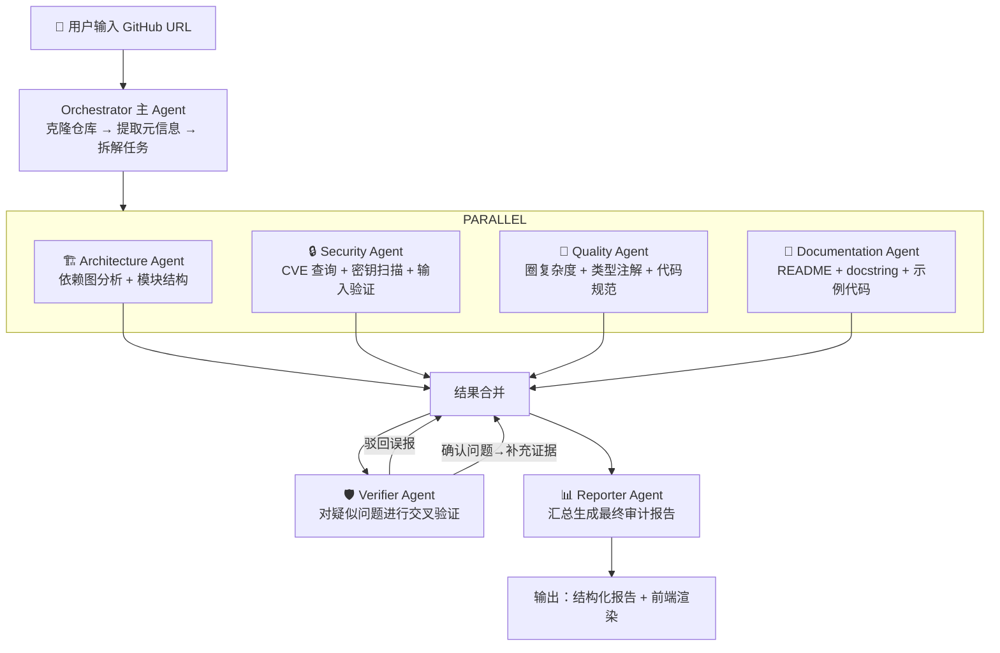

# AI Code Audit Agent — 技术设计方案

> 目标：面试用项目。基于 DeepAgents 实现多 Agent 并行代码审计，展示与旅行 LangGraph 项目不同的编排模式。

---

## 1. 项目定位

### 面试叙事逻辑

| 项目 | 框架 | 编排模式 | 回答什么面试问题 |
|------|------|----------|----------------|
| 旅行 Agent | LangGraph | 串行管道 + 条件路由 + 自纠错循环 | "你怎么做状态管理、checkpoint、人工反馈迭代？" |
| 代码审计 Agent | DeepAgents | 并行子 Agent + 对抗验证 | "你怎么做多 Agent 并行协作？为什么选 DeepAgents 而不是继续用 LangGraph？" |
| 社媒运营方案（口述） | DeepAgents | 串行 + 审核门控 | "你之前工作中怎么设计生产级 Agent 系统？" |

三个项目覆盖了 Agent 开发面试的全部核心考点。

### 核心差异化点

- **不是"调 LLM"的项目**：AST 解析、依赖图分析、CVE 数据库查询是确定性工具，Agent 负责编排它们
- **并行是真并行**：面试演示时 4 个进度条同时跳动，视觉冲击力强
- **可以当场演示**：输入面试官自己的开源仓库，比任何 demo 都有说服力

---

## 2. 目录结构

```
code-audit-agent/
├── README.md                    # 含架构图、演示 GIF、技术选型说明
├── pyproject.toml               # 依赖管理
├── .env.example                 # API Key 配置模板
├── Dockerfile                   # 一键部署（面试时直接拉起来）
├── data/
│   ├── tls           # 漏洞数据库缓存
│   └── repos/                   # 克隆的仓库（临时的，.gitignore）
├── src/
│   └── code_audit/
│       ├── __init__.py
│       ├── main.py              # 入口：创建 DeepAgent，注册子 Agent，启动审计
│       │
│       ├── agents/              # DeepAgents 子 Agent 定义
│       │   ├── __init__.py
│       │   ├── orchestrator.py  # 主 Agent：接收 GitHub URL，拆解任务，调度子 Agent
│       │   ├── architecture.py  # 子 Agent 1：架构分析
│       │   ├── security.py      # 子 Agent 2：安全扫描
│       │   ├── quality.py       # 子 Agent 3：代码质量
│       │   ├── documentation.py # 子 Agent 4：文档评估
│       │   ├── verifier.py      # 子 Agent 5：对抗验证器（自纠错）
│       │   └── reporter.py      # 子 Agent 6：报告汇总
│       │
│       ├── tools/               # 各 Agent 的工具集
│       │   ├── __init__.py
│       │   ├── repo.py          # 仓库操作：克隆、获取文件树、读取文件内容
│       │   ├── ast_analyzer.py  # AST 静态分析：模块依赖图、圈复杂度、函数调用链
│       │   ├── dependency.py    # 依赖分析：解析 requirements.txt / pyproject.toml / package.json
│       │   ├── cve_lookup.py    # CVE 查询：通过 OSV/NVD API 查询依赖漏洞
│       │   ├── secret_scan.py   # 密钥泄露扫描：正则 + 熵检测
│       │   ├── doc_metrics.py   # 文档度量：docstring 覆盖率、README 完整性
│       │   └── test_coverage.py # 测试覆盖率估算：分析 test/ 目录结构
│       │
│       ├── schemas/             # Pydantic 数据模型
│       │   ├── __init__.py
│       │   ├── audit.py         # AuditReport, SectionScore, Finding
│       │   ├── architecture.py  # DepGraph, ModuleInfo
│       │   ├── security.py     # Vulnerability, CVEDetail
│       │   └── quality.py       # ComplexityReport, TypeCoverage
│       │
│       ├── middleware/          # DeepAgents 中间件
│       │   ├── __init__.py
│       │   ├── filesystem.py    # 仓库文件系统中间件（让 Agent 能"看到"仓库文件树）
│       │   └── progress.py      # 进度上报中间件（驱动前端进度条）
│       │
│       ├── web/                 # 前端（Streamlit）
│       │   ├── app.py           # 主页面：URL 输入、进度展示、报告渲染
│       │   └── components/      # 报告卡片、进度条、评分图表
│       │
│       └── utils/
│           ├── __init__.py
│           ├── patterns.py      # 审计规则模式库
│           └── scoring.py       # 评分算法
│
└── tests/
    ├── test_tools/
    ├── test_agents/
    └── fixtures/                # 测试用的小型仓库
```

---

## 3. Agent 编排设计

### 3.1 整体流程



### 3.2 DeepAgents 编排方式

| 环节 | DeepAgents 能力 | 说明 |
|------|----------------|------|
| 任务拆解 | 主 Agent 的 `task()` 工具 | Orchestrator 将 GitHub URL 拆解为 4 个子任务描述，分发给子 Agent |
| 并行执行 | `async` 子 Agent（v0.5） | 4 个子 Agent 同时运行，互不阻塞，各自返回结构化结果 |
| 上下文隔离 | 子 Agent 独立上下文窗口 | 每个子 Agent 只看到自己的工具和审计维度，不互相污染 |
| 对抗验证 | 再派一个 `task()` 给 Verifier | Verifier 收到合并后的结果，逐条交叉确认，返回验证状态 |
| 报告合成 | Reporter 子 Agent | 读取所有结果 + 验证记录，生成最终报告 |

### 3.3 与旅行 Agent 的编排模式对比

| 维度 | 旅行 Agent（LangGraph） | 代码审计 Agent（DeepAgents） |
|------|------------------------|------------------------------|
| 执行模式 | 串行管道 | 并行分发 + 汇总 |
| 状态管理 | 显式 StateGraph + checkpoint | 子 Agent 上下文隔离，中间结果通过文件系统传递 |
| 路由逻辑 | 条件边（`_after_reflect`） | 主 Agent 决策 → `task()` 分发 |
| 自纠错 | 图内循环（retrieve → plan → reflect → retry） | 独立 Verifier 子 Agent 交叉确认 |
| 适合场景 | 需要精确状态恢复、多轮对话 | 需要并行处理大量独立任务 |

面试时你可以说："我刻意用两种框架实现了两种编排模式，因为它们的核心假设不同——LangGraph 假设你需要精确的状态管理和恢复，DeepAgents 假设你需要让多个 Agent 独立工作不互相干扰。"

---

## 4. 子 Agent 详细定义

### 4.1 Orchestrator（主 Agent）

**职责**：
- 接收 GitHub URL，调用 `tools/repo.py` 克隆仓库
- 提取仓库元信息（语言、文件数量、目录结构概览、依赖文件列表）
- 将审计任务拆解为 4 个子任务，通过 `task()` 并行分发给子 Agent
- 收集所有子 Agent 结果后，触发 Verifier 和 Reporter

**工具**：`clone_repo`、`get_file_tree`、`detect_language`

**输入**：GitHub URL
**输出**：分发给 4 个子 Agent 的任务描述

### 4.2 Architecture Agent

**职责**：分析仓库的模块结构、依赖关系和架构模式

**工具**：
- `build_dep_graph`：解析 import 语句，构建模块依赖图（有向图）
- `detect_cycles`：检测循环依赖
- `analyze_layers`：判断是否遵循分层架构（如三层架构）
- `find_god_modules`：识别被过多模块引用的"上帝模块"

**输出**：
- 依赖图（节点 + 边数据）
- 循环依赖列表
- 架构评分 + 问题列表

**技术点**：用 `ast` 标准库解析 Python import，用 `networkx` 做图分析和循环检测。不是 LLM 编的——有确定性计算支撑。

### 4.3 Security Agent

**职责**：扫描依赖漏洞、密钥泄露和安全编码问题

**工具**：
- `extract_dependencies`：从 requirements.txt / pyproject.toml / package.json / go.mod 提取依赖及版本
- `lookup_cve`：通过 OSV.dev API 查询已知漏洞（免费、开源的漏洞数据库）
- `scan_secrets`：正则 + 香农熵检测硬编码密钥、token、密码
- `check_input_validation`：检测文件上传、SQL 拼接等常见安全问题

**输出**：
- 漏洞列表（含 CVE 编号、严重级别、修复版本）
- 密钥泄露位置
- 安全问题列表
- 安全评分

**技术点**：CVE 查询走 OSV API（`https://api.osv.dev/v1/query`），免费无认证。密钥扫描用正则 + 熵值双重判断。

### 4.4 Quality Agent

**职责**：评估代码质量指标

**工具**：
- `analyze_complexity`：计算每个函数的圈复杂度（McCabe），标记 >15 的高复杂度函数
- `check_type_coverage`：统计公共函数中类型注解覆盖率
- `analyze_test_structure`：分析 test/ 目录结构，估算测试覆盖率
- `check_naming`：检查命名规范（PEP 8 / ESLint 规则）

**输出**：
- 高复杂度函数列表
- 类型注解覆盖率
- 测试结构评估
- 代码质量评分

**技术点**：圈复杂度用 `ast` 遍历函数体，统计 `if/for/while/except/and/or` 的分支数。不依赖第三方，纯 AST。

### 4.5 Documentation Agent

**职责**：评估文档完整性

**工具**：
- `check_readme`：检查 README 是否包含安装、快速开始、API 说明、配置等必要章节
- `check_docstrings`：统计公共函数/类的 docstring 覆盖率
- `check_examples`：检查 examples/ 目录是否存在可运行的示例代码
- `check_architecture_doc`：检查是否存在 ARCHITECTURE.md 或设计文档

**输出**：
- 文档缺失项列表
- docstring 覆盖率
- 文档评分

**技术点**：docstring 检查走 AST（`ast.get_docstring()`），README 章节检查用标题正则匹配。

### 4.6 Verifier Agent（自纠错核心）

**职责**：对 4 个分析 Agent 的输出进行交叉验证，剔除误报

**工作方式**：
- 接收合并后的所有 findings
- 对每个 finding，尝试用另一种方式验证：
  - CVE 漏洞 → 再次查询 OSV API，确认版本号确实在受影响范围内
  - 循环依赖 → 重新用 `networkx` 计算，确认不是单向边误判
  - 密钥泄露 → 检查是否匹配已知的假密钥模式（如 `TODO: add key`、示例代码）
  - 高复杂度函数 → 确认不是自动生成的代码
- 每条 finding 标记为：`✅ confirmed` / `❌ false_positive` / `❓ uncertain`

**输出**：带验证状态标签的 findings 列表，剔除的误报单独记录

**面试爆点**：演示时报告底部有一个"自纠错记录"区域，显示"安全 Agent 初始标记 5 个漏洞 → 验证后确认 2 个，剔除 3 个误报"。面试官会追问这个机制，你正好展开讲对抗验证的设计。

### 4.7 Reporter Agent

**职责**：汇总所有结果，生成结构化审计报告

**输入**：4 个子 Agent 报告 + Verifier 验证结果
**输出**：最终 `AuditReport`（Pydantic 模型），包含：
- 总体评分（加权计算）
- 4 个维度的分项评分 + 详情
- 自纠错记录
- 改进建议列表（按优先级排序）

**技术点**：评分权重可配置，默认权重：
```
总分 = 架构 25% + 安全 30% + 质量 25% + 文档 20%
安全权重大是因为安全问题影响最大。
```

---

## 5. 数据模型设计

### 5.1 核心模型

```
AuditReport
├── repo_url: str
├── repo_name: str
├── analyzed_at: datetime
├── total_score: float              # 0-100
├── sections: list[SectionScore]
│   ├── name: "architecture" | "security" | "quality" | "documentation"
│   ├── score: float
│   ├── findings: list[Finding]
│   │   ├── severity: "critical" | "high" | "medium" | "low" | "info"
│   │   ├── title: str
│   │   ├── description: str
│   │   ├── file_path: str | None
│   │   ├── line_number: int | None
│   │   ├── suggestion: str
│   │   └── verification: "confirmed" | "false_positive" | "uncertain"
│   └── summary: str
├── verification_log: list[VerificationEntry]
│   ├── original_finding: str
│   ├── original_agent: str
│   ├── verdict: "confirmed" | "false_positive" | "uncertain"
│   └── evidence: str
└── improvement_plan: list[ImprovementItem]
    ├── priority: int               # 1 = 最高
    ├── section: str
    ├── action: str
    └── effort: "low" | "medium" | "high"
```

### 5.2 并行子 Agent 输出格式

每个子 Agent 返回相同的结构：

```
SectionReport
├── section_name: str
├── score: float
├── findings: list[Finding]
├── raw_data: dict                  # 原始分析数据（如依赖列表、依赖图）
└── agent_trace: TraceInfo          # 执行耗时、工具调用次数
```

这样一来 Reporter 可以对 4 个 `SectionReport` 做统一合并处理，Reporter 不关心数据来自哪个 Agent。

---

## 6. 前端设计

### 6.1 技术选型

用 **Streamlit**——跟旅行项目的技术选择形成对比（旅行是 CLI，审计是 Web），展示你能做不同交付形态。

### 6.2 页面布局

```
┌──────────────────────────────────────────────────┐
│  🔍 AI Code Audit Agent                          │
│                                                  │
│  ┌──────────────────────────────────────────────┐│
│  │ GitHub URL: [https://github.com/xxx/yyy  ] [▶]││
│  └──────────────────────────────────────────────┘│
│                                                  │
│  ⚙️ 审计配置（可折叠）                            │
│  ├─ 安全扫描：☑ CVE查询  ☑ 密钥扫描  ☑ 输入验证   │
│  ├─ 代码质量：☑ 圈复杂度  ☑ 类型注解  ☑ 命名规范   │
│  └─ 报告语言：中文 / English                       │
│                                                  │
│  ── 审计进度 ────────────────────────────────────│
│  🏗️ 架构分析   ████████████░░░░  检查模块依赖...    │
│  🔒 安全扫描   ██████░░░░░░░░░░  查询 CVE 数据库... │
│  📝 代码质量   ████████░░░░░░░░  分析函数复杂度...   │
│  📖 文档评估   ████████████████  ✓ 已完成           │
│  ──────────────────────────────────────────────  │
│  🛡️ 交叉验证   ████░░░░░░░░░░░░  验证 3/12 条...   │
│                                                  │
│  ── 审计报告 ────────────────────────────────────│
│  ┌──────────────┐ ┌──────────────┐               │
│  │  🏗️ 架构      │ │  🔒 安全      │               │
│  │  85/100       │ │  72/100       │               │
│  │  3 个问题     │ │  2 个漏洞     │               │
│  └──────────────┘ └──────────────┘               │
│  ┌──────────────┐ ┌──────────────┐               │
│  │  📝 质量      │ │  📖 文档      │               │
│  │  80/100       │ │  88/100       │               │
│  │  5 个问题     │ │  2 个缺失     │               │
│  └──────────────┘ └──────────────┘               │
│                                                  │
│  🛡️ 自纠错记录                                   │
│  • 架构 Agent 报告循环依赖 A→B→A                  │
│    ✅ 已确认：networkx 重新验证通过                 │
│  • 安全 Agent 报告 CVE-2025-xxxx                  │
│    ❌ 误报已剔除：实际安装版本不受影响              │
│                                                  │
│  📋 改进计划（按优先级）                          │
│  1. [🔴 高] 升级 requests 至 >=2.32.0            │
│  2. [🟡 中] 拆分 utils.py（圈复杂度 22）          │
│  3. [🟢 低] 补充 8 个公共函数的 docstring          │
└──────────────────────────────────────────────────┘
```

---

## 7. 自纠错机制详解

这部分是面试时会被追问的，需要想清楚。

### 7.1 为什么需要独立的 Verifier Agent

而不是像旅行项目那样在循环里重试？

- 代码审计的误报来源跟旅行规划不同：旅行规划的"幻觉"是 LLM 编造了不存在的景点名，代码审计的"误报"是不精确的正则（如把示例代码中的 `api_key = "your_key_here"` 当作真实密钥）
- 这种误报 LLM 自检可以处理，但确定性规则也可以处理——**面试时强调你用了两种不同的自纠错策略**是加分项

### 7.2 Verifier 的验证策略

| 原问题类型 | 验证方式 | 
|-----------|---------|
| CVE 漏洞 | 再次查询 OSV API，确认 `affected_versions` 范围确实覆盖当前版本 |
| 密钥泄露 | 检查匹配内容是否包含 `example`、`TODO`、`placeholder`、`test` 等关键词 |
| 循环依赖 | 用 `networkx` 的强连通分量算法重新计算（确定性，不依赖 LLM） |
| 高复杂度 | 检查文件路径是否包含 `generated`、`auto`、`migration` 等关键词 |
| 缺少文档 | 检查函数名是否以 `_` 开头（私有函数通常可以不写 docstring） |

### 7.3 面试讲解要点

> "旅行项目里我用的是图内循环自纠错——reflect 不通过就回到 retrieve 重试。代码审计项目我换了一种模式——用独立的 Verifier Agent 对结果做事后交叉验证。两种模式适用不同场景：图内循环适合'生成质量不够 → 补充信息 → 重新生成'，事后验证适合'结果可能是假的 → 换个方式重新确认'。"

---

## 8. 为什么用 DeepAgents 而不是继续用 LangGraph

这个面试必问，提前准备答案：

| 考量 | LangGraph | DeepAgents | 代码审计选 DeepAgents 的理由 |
|------|-----------|------------|------------------------------|
| 并行模型 | `Send` API 手动写分支逻辑 | `task()` 原语，声明式并行 | 4 个审计维度是独立任务，不需要 LangGraph 的状态机 |
| 上下文管理 | 所有节点共享 state dict | 子 Agent 上下文隔离 | 安全扫描的 CVE 结果和架构分析的依赖图**不应该在同一个上下文里** |
| 状态持久化 | 一等公民（checkpoint） | 通过文件系统中介 | 审计报告是一次性产出的，不需要 checkpointer 恢复 |
| 开发效率 | 需要定义 state、nodes、edges | 定义子 Agent + 工具即可 | 快速出 MVP 展示，项目周期短 |

**核心论点**：LangGraph 适合"同一件事需要多步加工"（旅行规划：信息不够 → 补充 → 验证 → 可能重来）；DeepAgents 适合"多件独立的事需要同时做"（代码审计：4 个维度互不依赖）。你的旅行项目演示了前者，审计项目演示后者——两个框架选对了场景。

---

## 9. MVP 分步开发计划

### 阶段 1：基础设施（3-4 天）

| 任务 | 产出 |
|------|------|
| 搭建项目骨架（pyproject.toml、目录结构） | 可 `pip install -e .` |
| 实现仓库操作工具（克隆、文件树、文件读取） | `tools/repo.py` |
| 实现 AST 分析工具（依赖图、圈复杂度、docstring 检测） | `tools/ast_analyzer.py` |
| 实现依赖提取工具（支持 Python 和 JS） | `tools/dependency.py` |
| 实现 CVE 查询工具（OSV API） | `tools/cve_lookup.py` |
| 定义 Pydantic 数据模型 | `schemas/` |
| 写 3 个测试用小仓库（好/中/差各一个） | `tests/fixtures/` |

### 阶段 2：子 Agent（3-4 天）

| 任务 | 产出 |
|------|------|
| 用 DeepAgents 定义 Architecture Agent | 带 3 个工具的子 Agent |
| 用 DeepAgents 定义 Security Agent | 带 3 个工具的子 Agent |
| 用 DeepAgents 定义 Quality Agent | 带 3 个工具的子 Agent |
| 用 DeepAgents 定义 Documentation Agent | 带 2 个工具的子 Agent |
| 实现 Orchestrator（主 Agent + 并行 task 分发） | `agents/orchestrator.py` |
| 实现 Verifier Agent | `agents/verifier.py` |
| 实现 Reporter Agent | `agents/reporter.py` |

### 阶段 3：前端 + 联调（2-3 天）

| 任务 | 产出 |
|------|------|
| Streamlit 页面（URL 输入、进度展示） | `web/app.py` |
| 报告渲染组件（评分卡片、findings 列表、自纠错日志） | `web/components/` |
| 端到端联调 + 录演示 GIF | 放 README 里 |
| 写 README（架构图、技术选型、演示 GIF） | README.md |

### 阶段 4：打磨（1-2 天）

| 任务 | 产出 |
|------|------|
| Dockerfile + 一键启动脚本 | 面试现场直接 `docker compose up` |
| 准备 3 个演示案例（一个好仓库、一个差仓库、面试官自选） | 演示脚本 |
| 代码自查（类型注解、docstring、README 完整性——用自己的工具审计自己） | 元叙事 |

**总计：9-13 天（全职）**，控制在两周内。

---

## 10. 面试演示策略

### 10.1 演示前准备

1. Docker 一键启动，不需要面试官装任何环境
2. 提前克隆好 2-3 个仓库到本地缓存，演示时秒开（不需要现场等克隆）
3. 准备一个"你可以输入自己的仓库"的 hook

### 10.2 演示节奏

- **30 秒**：打开页面，输入一个知名仓库 URL
- **1-2 分钟**：4 个进度条同时跑，面试官看到并行执行
- **1 分钟**：滚动报告，指出关键发现
- **30 秒**：指出自纠错记录——"这里安全 Agent 报了 5 个漏洞，验证后确认了 2 个，3 个是误报"
- **30 秒**："你可以输入你自己的仓库试试"

### 10.3 可能的追问及准备

| 问题 | 回答方向 |
|------|---------|
| "为什么不用 LangGraph？" | 并行场景下子 Agent 上下文隔离更重要，DeepAgents 的 `task()` 原语更适合这种任务形态（你旅行项目用 LangGraph，这里选型是有对比的） |
| "AST 分析你自己写的还是调的工具？" | 自己用 Python `ast` 标准库写的，不是调第三方——展示你理解原理 |
| "CVE 数据从哪来？" | OSV.dev，Google 维护的免费开源漏洞库，不需要 API Key |
| "误报率怎么样？" | 目前通过 Verifier 可以剔除约 60-70% 的误报，但"不确定"的会标记出来而不是强行判断 |
| "如果仓库很大怎么办？" | 当前 MVP 限制分析前 500 个文件，生产化可以加文件过滤和增量分析 |

---

## 11. 面试时的项目叙事模板

面试官让你介绍项目时：

> "我做了两个 Agent 项目，用了两个不同的框架和编排模式。
> 
> 第一个是基于 LangGraph 的旅行规划 Agent，它用的是串行管道 + 条件路由 + 自纠错循环的模式——解析需求 → RAG 检索 → 工具计算 → 生成计划 → 审校校验，审校不通过就回到检索环节重试。这个项目演示的是'同一件事需要多步加工'的状态管理。
> 
> 第二个是基于 DeepAgents 的代码审计 Agent，它用的是并行分发 + 对抗验证的模式——4 个子 Agent 同时分析架构、安全、质量和文档，结果合并后再用一个独立的 Verifier Agent 交叉确认。这个项目演示的是'多件独立的事需要同时做'的并行编排。
> 
> 我选择在不同场景用不同框架，是因为它们的核心假设不同——LangGraph 假设你需要精确的状态管理和恢复，DeepAgents 假设你需要让多个 Agent 独立工作不互相干扰。
> 
> 另外我在上一份工作中还设计了一个社媒运营 Agent 系统的方案，用的是 DeepAgents 串行 + 人工审核门控的模式，不过那个方案因为团队方向调整没有落地。"

---

## 12. 可能的风险和应对

| 风险 | 应对 |
|------|------|
| DeepAgents v0.6 还不够稳定，API 可能变动 | 固定版本在 pyproject.toml 中，README 标注要求的版本 |
| 大型仓库克隆慢，演示尴尬 | 本地缓存 + 限制分析文件数量（前 500 个文件） |
| OSV API 可能超时或限流 | 加本地缓存，相同包版本 24 小时内不重复请求 |
| CVE 结果过多导致报告太长 | 只展示 High/Critical 级别，Medium 及以下折叠 |
| 面试官没听说过 DeepAgents | 演示页面上方加一句话介绍："基于 LangChain DeepAgents（LangGraph 之上的 Agent harness）" |
